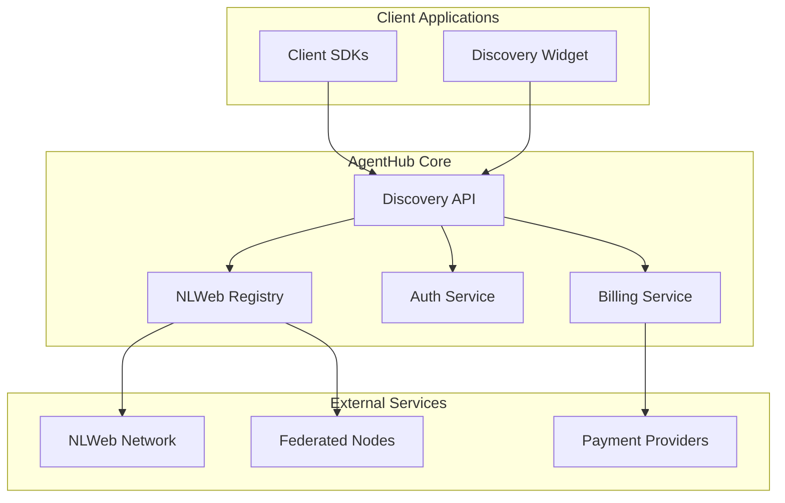

# AgentHub Architecture Documentation

## 1. System Overview

AgentHub is a decentralized agent registry built on NLWeb that enables discovery, integration, and monetization of AI agents across the network.

### 1.1 High-Level Architecture



### 1.2 Key Components

#### NLWeb Registry
- Maintains decentralized catalog of available agents
- Handles agent metadata, capabilities, and pricing
- Supports federation across network nodes
- Provides versioning and update mechanisms

#### Discovery API
- RESTful API for agent search and integration
- Handles authentication and rate limiting
- Manages billing and usage tracking
- Supports webhook integrations

#### Client SDKs
- JavaScript and Python implementations
- Abstracts authentication and API interactions
- Provides type-safe interfaces
- Handles error recovery and retry logic

#### Discovery Widget
- Embeddable UI component
- Customizable search and filtering
- Direct agent integration capabilities
- Usage analytics and reporting

#### Billing Service
- Integration with Stripe/PayPal
- Usage-based billing support
- Subscription management
- Revenue sharing implementation

### 1.3 Data Flow

1. Client Discovery
   ```mermaid
   sequenceDiagram
       Client->>API: Search for agents
       API->>Registry: Query catalog
       Registry->>Federation: Federated search
       Federation->>Registry: Aggregate results
       Registry->>API: Return matches
       API->>Client: Filtered results
   ```

2. Agent Integration
   ```mermaid
   sequenceDiagram
       Client->>API: Request agent access
       API->>Auth: Validate credentials
       Auth->>Billing: Check subscription
       Billing->>Payment: Process transaction
       Payment->>Billing: Confirm payment
       Billing->>API: Grant access
       API->>Client: Return credentials
   ```

## 2. Component Specifications

### 2.1 NLWeb Registry

#### Catalog Structure
```json
{
  "agents": {
    "id": "uuid",
    "name": "string",
    "version": "semver",
    "capabilities": ["string"],
    "pricing": {
      "model": "enum(usage|subscription)",
      "rates": [{
        "tier": "string",
        "price": "decimal",
        "limits": {}
      }]
    },
    "metadata": {
      "description": "string",
      "provider": "string",
      "documentation": "url",
      "examples": ["string"]
    },
    "federation": {
      "node": "url",
      "replicas": ["url"]
    }
  }
}
```

#### Federation Protocol
- Peer discovery via NLWeb network
- Catalog synchronization using CRDTs
- Conflict resolution strategies
- Health checking and failover

### 2.2 Discovery API

#### Endpoints
```yaml
/agents:
  get:
    description: Search agents catalog
    parameters:
      - name: q
        description: Search query
      - name: capabilities
        description: Required capabilities
      - name: pricing
        description: Price range/model
    responses:
      200:
        description: Matching agents
        
/agents/{id}:
  get:
    description: Get agent details
  post:
    description: Request agent access
    
/webhooks:
  post:
    description: Integration webhooks
```

### 2.3 Client SDKs

#### JavaScript SDK
```typescript
interface AgentHubClient {
  search(query: SearchParams): Promise<Agent[]>;
  integrate(id: string): Promise<Credentials>;
  subscribe(webhook: WebhookConfig): void;
}
```

#### Python SDK
```python
class AgentHubClient:
    def search(self, **params) -> List[Agent]
    def integrate(self, agent_id: str) -> Credentials
    def subscribe(self, webhook: WebhookConfig) -> None
```

### 2.4 Billing Integration

#### Payment Flow
1. Usage tracking via API
2. Aggregation by billing service
3. Payment processing (Stripe/PayPal)
4. Revenue distribution
5. Usage limits enforcement

## 3. Technical Requirements

### 3.1 API Specifications

#### Authentication
- OAuth 2.0 with JWT tokens
- Scoped permissions
- API key management
- Session handling

#### Rate Limiting
- Token bucket algorithm
- Tier-based limits
- Retry-After headers
- Usage monitoring

#### Response Format
```json
{
  "data": {},
  "meta": {
    "page": 1,
    "total": 100,
    "limit": 10
  },
  "links": {
    "self": "url",
    "next": "url"
  }
}
```

### 3.2 Data Schemas

#### Agent Schema
```yaml
type: object
required:
  - id
  - name
  - version
properties:
  id:
    type: string
    format: uuid
  name:
    type: string
    minLength: 1
  version:
    type: string
    pattern: "^\\d+\\.\\d+\\.\\d+$"
  capabilities:
    type: array
    items:
      type: string
```

#### Integration Schema
```yaml
type: object
required:
  - agent_id
  - credentials
properties:
  agent_id:
    type: string
    format: uuid
  credentials:
    type: object
    properties:
      api_key:
        type: string
      expires_at:
        type: string
        format: date-time
```

## 4. Security Considerations

### 4.1 Authentication & Authorization

- Multi-factor authentication support
- Role-based access control (RBAC)
- JWT token validation
- API key rotation
- Session management
- IP allowlisting

### 4.2 Data Validation

- Input sanitization
- Schema validation
- Rate limiting
- Request size limits
- Content type verification
- File upload restrictions

### 4.3 API Security

- TLS 1.3 required
- CORS policy
- CSP headers
- HSTS enabled
- Request signing
- Audit logging
- DDoS protection
- API versioning

### 4.4 Error Handling

```json
{
  "error": {
    "code": "string",
    "message": "string",
    "details": {}
  },
  "request_id": "uuid"
}
```

## 5. Implementation Guidelines

### 5.1 Development Standards

- TypeScript for SDK development
- OpenAPI/Swagger documentation
- Automated testing requirements
- Code style guidelines
- Error handling patterns
- Logging standards

### 5.2 Deployment Requirements

- Container orchestration
- Health monitoring
- Metrics collection
- Log aggregation
- Backup strategy
- Scaling policies
- Failover procedures

### 5.3 Integration Testing

- End-to-end test suites
- Performance benchmarks
- Security scanning
- Load testing
- API compliance
- SDK verification